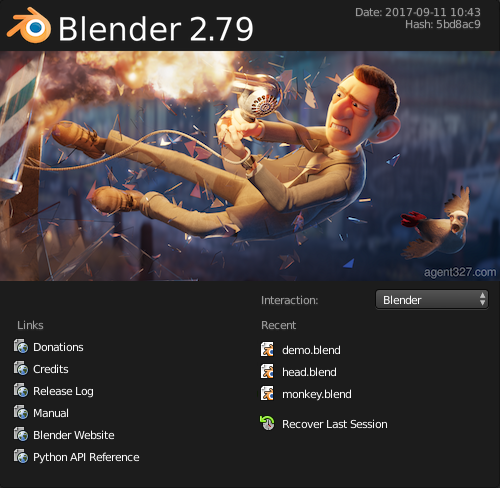

# 用户接口

## 启动画面

启动Blender时，启动画面会出现在窗口的中央。 它包含帮助链接和最近打开的Blender文件。 下面可以看到更详细的描述。

## 介绍

启动Blender并关闭Splash Screen之后，Blender窗口应该与下面的图像类似。 Blender的用户界面在所有平台上都是一致的。

### 接口元素(Interface Elements)

Window -> Screen ->  Areas ->  Editors ->  Regions ->  (Tabs) ->  Panels ->  Controls

窗口->屏幕->地域->编辑器->地带->标签->面板->Controls

该界面可以自定义，以使用屏幕布局来匹配特定任务，然后可以将其命名并保存供以后使用。 默认屏幕如下所述。

屏幕被组织成一个或多个区域，每个区域都包含一个编辑器。

### 默认屏幕(The Default Screen)

默认情况下Blender启动后显示默认屏幕，该屏幕分为五个地域，其中包含下列编辑器：

* 顶端的消息编辑器(Info)
* 一个大的3D视图.(3D View)
* 在底部的一个时间轴。(Timeline)
* 右上角的大纲视图。(Outliner)
* 右下角的属性编辑器 (Properties)。

### 编辑器的组件(Components of an Editor)

一般来说，编辑器提供了查看和修改Blender作品的特定部分的方法。 编辑分为区域(Regions)。 
区域可以具有更小的构造元素，如标签和面板，其中包含按钮，控件和小部件。

### 用户接口原则(User Interface Principles)

不重叠

* UI旨在使您能够一目了然地查看所有相关选项和工具，而不必推动或拖动编辑器。

非阻塞

* 工具和界面选项不会阻塞Blender的任何其他部分。Blender通常不使用弹出框（要求用户在运行操作之前填写数据）。

Non Modal Tools

* 可以有效地访问工具，而不用花时间在不同的工具之间选择。许多工具使用一致和可预测的鼠标和键盘操作进行交互。

### 定制

Blender也大量使用键盘快捷键来加快工作。 这些也可以在键盘映射编辑器中进行自定义。

### 主题颜色 

Blender允许更改大部分界面颜色设置以适应用户的需要。 
如果您发现屏幕上显示的颜色与“手册”中提到的颜色不符，
那么可能是您的默认主题已被更改。 创建新主题或选择/更改预先存在的主题
通过选择 文件->用户首选项->并单击主题选项卡来完成。

`File->User Preference->Theme`

## 屏幕(Screens)

屏幕基本上是预定义的窗口布局。
Blender与地域(Areas)的灵活性使您可以为不同的任务创建自定义的工作环境，如建模，
动画和脚本。 快速切换同一文件中的不同环境通常很有用。
有关如何移动框架边框，拆分和合并地域(Areas)，请参阅地域(Areas)控件。

The Screen data-block menu, that lets you select the layouts, is located in the Info Editors header.

### 控制

* Screen Layout

A list of available Screen layouts. See [Default Screens](#default_screens)

* Add +

Click on the Add button and a new frame layout will be created based on your current layout.

* Delete X

You can delete the selected screen by using the Delete button.

### Shortcuts

To cycle between screens use Ctrl-Right and Ctrl-Left.

Note

On macOS you may need to disable the shortcuts for “Mission Control” in your computer’s preferences. These can be found in System Preferences ‣ Keyboard ‣ Shortcuts.

### Default Screens 

3D View Full:	A full screen 3D View, used to preview your scene.
Animation:	Making actors and other objects move about, change shape or color, etc.
Compositing:	Combining different parts of a scene (e.g. background, actors, special effects) and filter them (e.g. color correction).
Default:	The default layout used by Blender for new files. Useful for modeling new objects.
Game Logic:	Planning and programming of games within Blender.
Motion Tracking:
 	Used for motion tracking with the movie clip editor.
Scripting:	Documenting your work and/or writing custom scripts to automate Blender.
UV Editing:	Flattening a projection of an object mesh in 2D to control how a texture maps to the surface.
Video Editing:	Cutting and editing of animation sequences.

### Save and Override
The screen layouts are saved in the blend-file. When you open a file, enabling the Load UI in the file browser indicates that Blender should use the file’s screen layouts and overriding the current layout. See Load UI.

A custom set of screen layouts can be saved as a part of the Startup File.

### Additional Layouts
As you become more experienced with Blender, consider adding some other screen layouts to suit your workflow as this will help increase your productivity. Some examples could include:

Modeling:	Four 3D Views (top, front, side and perspective), Properties editor for Editing.
Lighting:	3D Views for moving lights, UV/Image editor for displaying Render Result, Properties editor for rendering and lamp properties and controls.
Materials:	Properties editor for Material settings, 3D View for selecting objects, Outliner, Library script (if used), Node Editor (if using Node based materials).
Painting:	UV/Image Editor for texture painting image, 3D View for painting directly on object in UV Face Select mode, three mini-3D Views down the side that have background reference pictures set to full strength, Properties editor.

## Areas

## Regions

## Tabs & Panels
## Interface Controls
## Buttons and Controls
## Buttons
## Menus
## Toggle & Radio Buttons
## Number Buttons
## Eyedropper
## Extended Controls
## Data-Block Menu
## List Views & Presets
## Color Picker
## Color Ramp Widget
## Curve Widget
## Operator Search
## Common Shortcuts
## Tools
## Undo and Redo
## Ruler and Protractor
## Grease Pencil