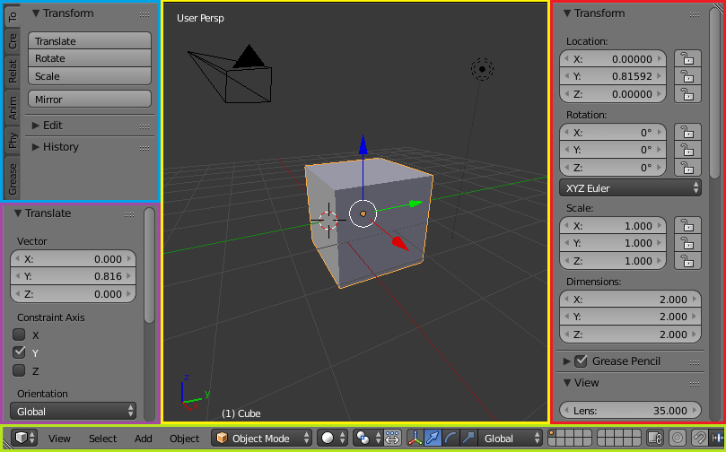

# 用户接口

## 启动画面

启动Blender时，启动画面会出现在窗口的中央。 它包含帮助链接和最近打开的Blender文件。 下面可以看到更详细的描述。

## 介绍

启动Blender并关闭Splash Screen之后，Blender窗口应该与下面的图像类似。 Blender的用户界面在所有平台上都是一致的。

### 接口元素(Interface Elements)

Window -> Screen ->  Areas ->  Editors ->  Regions ->  (Tabs) ->  Panels ->  Controls

窗口->屏幕->地域->编辑器->地带->标签->面板->Controls

该界面可以自定义，以使用屏幕布局来匹配特定任务，然后可以将其命名并保存供以后使用。 默认屏幕如下所述。

屏幕被组织成一个或多个区域，每个区域都包含一个编辑器。

### 默认屏幕(The Default Screen)

默认情况下Blender启动后显示默认屏幕，该屏幕分为五个地域，其中包含下列编辑器：

* 顶端的消息编辑器(Info)
* 一个大的3D视图.(3D View)
* 在底部的一个时间轴。(Timeline)
* 右上角的大纲视图。(Outliner)
* 右下角的属性编辑器 (Properties)。

### 编辑器的组件(Components of an Editor)

一般来说，编辑器提供了查看和修改Blender作品的特定部分的方法。 编辑分为区域(Regions)。 
区域可以具有更小的构造元素，如标签和面板，其中包含按钮，控件和小部件。

### 用户接口原则(User Interface Principles)

不重叠

* UI旨在使您能够一目了然地查看所有相关选项和工具，而不必推动或拖动编辑器。

非阻塞

* 工具和界面选项不会阻塞Blender的任何其他部分。Blender通常不使用弹出框（要求用户在运行操作之前填写数据）。

Non Modal Tools

* 可以有效地访问工具，而不用花时间在不同的工具之间选择。许多工具使用一致和可预测的鼠标和键盘操作进行交互。

### 定制

Blender也大量使用键盘快捷键来加快工作。 这些也可以在键盘映射编辑器中进行自定义。

### Theme colors

Blender允许更改大部分界面颜色设置以适应用户的需要。 
如果您发现屏幕上显示的颜色与“手册”中提到的颜色不符，
那么可能是您的默认主题已被更改。 创建新主题或选择/更改预先存在的主题
通过选择 文件->用户首选项->并单击主题选项卡来完成。

`File->User Preference->Theme`

## Screens

Screens are essentially pre-defined window layouts. 
Blender’s flexibility with areas lets you create customized working environments for different tasks such as modeling, 
animating, and scripting. It is often useful to quickly switch between different environments within the same file. 
See area controls for how to move frame borders, split and consolidate areas.

The Screen data-block menu, that lets you select the layouts, is located in the Info Editors header.

## Areas

## Regions

## Tabs & Panels
## Interface Controls
## Buttons and Controls
## Buttons
## Menus
## Toggle & Radio Buttons
## Number Buttons
## Eyedropper
## Extended Controls
## Data-Block Menu
## List Views & Presets
## Color Picker
## Color Ramp Widget
## Curve Widget
## Operator Search
## Common Shortcuts
## Tools
## Undo and Redo
## Ruler and Protractor
## Grease Pencil