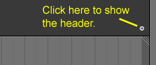
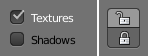
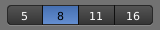

# 用户接口
	
## 启动画面

启动Blender时，启动画面会出现在窗口的中央。 
它包含帮助链接和最近打开的Blender文件。 下面可以看到更详细的描述。

## Window System

### 介绍

启动Blender并关闭Splash Screen之后，Blender窗口应该与下面的图像类似。 
Blender的用户界面在所有平台上都是一致的。

#### 接口元素(Interface Elements)

Window -> Screen ->  Areas ->  Editors ->  Regions ->  (Tabs) ->  Panels ->  Controls

窗口->屏幕->地域->编辑器->地带->标签->面板->Controls

该界面可以自定义，以使用屏幕布局来匹配特定任务，然后可以将其命名并保存供以后使用。 默认屏幕如下所述。

屏幕被组织成一个或多个区域，每个区域都包含一个编辑器。

#### 默认屏幕(The Default Screen)

默认情况下Blender启动后显示默认屏幕，该屏幕分为五个地域，其中包含下列编辑器：

* 顶端的消息编辑器(Info)
* 一个大的3D视图.(3D View)
* 在底部的一个时间轴。(Timeline)
* 右上角的大纲视图。(Outliner)
* 右下角的属性编辑器 (Properties)。

#### 编辑器的组件(Components of an Editor)

一般来说，编辑器提供了查看和修改Blender作品的特定部分的方法。 编辑分为区域(Regions)。 
区域可以具有更小的构造元素，如标签和面板，其中包含按钮，控件和小部件。

#### 用户接口原则(User Interface Principles)

* 不重叠:UI旨在使您能够一目了然地查看所有相关选项和工具，而不必推动或拖动编辑器。
* 非阻塞:工具和界面选项不会阻塞Blender的任何其他部分。Blender通常不使用弹出框（要求用户在运行操作之前填写数据）。
* Non Modal Tools:可以有效地访问工具，而不用花时间在不同的工具之间选择。许多工具使用一致和可预测的鼠标和键盘操作进行交互。

#### 定制

Blender也大量使用键盘快捷键来加快工作。 这些也可以在键盘映射编辑器中进行自定义。

#### 主题颜色 

Blender允许更改大部分界面颜色设置以适应用户的需要。 
如果您发现屏幕上显示的颜色与“手册”中提到的颜色不符，
那么可能是您的默认主题已被更改。 创建新主题或选择/更改预先存在的主题
通过选择 文件->用户首选项->并单击主题选项卡来完成。

`File->User Preference->Theme`
		
	
### 屏幕(Screens)
	

屏幕基本上是预定义的窗口布局。
Blender与地域(Areas)的灵活性使您可以为不同的任务创建自定义的工作环境，如建模，
动画和脚本。 快速切换同一文件中的不同环境通常很有用。
有关如何移动框架边框，拆分和合并地域(Areas)，请参阅地域(Areas)控件。

The Screen data-block menu, that lets you select the layouts, is located in the Info Editors header.

		
		
#### 控制

* 屏幕布局:可用的屏幕布局列表. 请看 [默认屏幕](#default_screens)
* Add +:单击添加按钮，将根据您当前的布局创建一个新的布局。
* Delete X:您可以使用删除按钮删除所选屏幕。
			
#### 快捷键

屏幕之间切换使用Ctrl-Right和Ctrl-Left。
		
#### 默认屏幕

* 3D View Full:	A full screen 3D View, used to preview your scene.
* Animation:	Making actors and other objects move about, change shape or color, etc.
* Compositing:	Combining different parts of a scene (e.g. background, actors, special effects) and filter them (e.g. color correction).
* Default:	The default layout used by Blender for new files. Useful for modeling new objects.
* Game Logic:	Planning and programming of games within Blender.
* Motion Tracking: Used for motion tracking with the movie clip editor.
* Scripting:	Documenting your work and/or writing custom scripts to automate Blender.
* UV Editing:	Flattening a projection of an object mesh in 2D to control how a texture maps to the surface.
* 视频编辑:	切割和编辑动画序列。

#### Save and Override
The screen layouts are saved in the blend-file. When you open a file, 
enabling the Load UI in the file browser indicates that Blender should use the file’s screen layouts and overriding the current layout. See Load UI.

A custom set of screen layouts can be saved as a part of the Startup File.

 
您对Blender有更多经验时，请考虑添加一些其他屏幕布局，以适应您的工作流程，因为这将有助于提高您的生产力。 一些例子可能包括：

* Modeling:	四个3D视图（顶，前，侧和透视），属性编辑器。
* Lighting:	3D Views for moving lights, UV/Image editor for displaying Render Result, Properties editor for rendering and lamp properties and controls.
* Materials: Properties editor for Material settings, 3D View for selecting objects, Outliner, Library script (if used), Node Editor (if using Node based materials).
* Painting:	UV/Image Editor for texture painting image, 3D View for painting directly on object in UV Face Select mode, three mini-3D Views down the side that have background reference pictures set to full strength, Properties editor.

### Areas

The application window is always a rectangle on your desktop. 
It is divided up into a number of re-sizable areas. 
An area contains the workspace for a particular type of editor, like a 3D View Editor, or an Outliner.

#### Arranging

Blender uses a novel screen-splitting approach to arrange areas. 
The idea is that you split up that big application window into any number of smaller (but still rectangular) non-overlapping areas. That way, 
each area is always fully visible, and it is very easy to work in one area and hop over to work in another.
			
#### Changing the Size

You can resize areas by dragging their borders with LMB. 
Simply move your mouse cursor over the border between two areas, 
until it changes to a double-headed arrow, and then click and drag

#### Splitting and Joining

一个区域的右上角和左下角是区域分割的小部件，它们看起来像一个有点脊椎拇指的握柄。
 它用于分开和组合区域(Areas)。 当您将鼠标悬停在其上时，将变为十字光标。

按住鼠标左键(LMB)并将其向内拖动拆分该区域(Areas)。 您可以通过水平或垂直拖动来定义该边框的方向。

In order to join two areas LMB(鼠标左键) click and drag the area splitter outward. They must be the same dimension (width or height) 
in the direction you wish to join. This is so that the combined area space results in a rectangle.
			

			
The area that will be closed gets a dark overlaid with an arrow. Now you can select the area to be closed by moving the mouse over it.

Release the LMB to complete the join. If you press Esc or RMB before releasing the mouse, the operation will be aborted.
			
#### Area Options

RMB on the border opens the Area Options.

* Split Area:Shows an indicator line that lets you select the area and position where to split. Tab switches between vertical/horizontal.
* Join Areas:Shows the join direction overlay.Confirm or cancel works as described above.

#### Swapping Contents
			
You can swap the contents between two areas with Ctrl-LMB on one of the splitters of the initial area, dragging towards the target area, and releasing the mouse there. 
The two areas do not need to be side by side, though they must be inside the same window.

#### Duplicate Area into new Window
		
`
Reference
	Menu: View->Duplicate Area into new Window
`
	
The new window is a fully functional window, which is part of the same instance of Blender. This can be useful, e.g. if you have multiple monitors.

A new window can be created from View ‣ Duplicate Area into new Window.

You can also create a new window from an existing area by Shift-LMB on the area splitter widget, then drag slightly.

The window can be closed with the OS Close Window button.

#### Toggle Maximize Area
			`
Reference

Menu: View ‣ Toggle Maximize Area
Hotkey: Ctrl-Up, Shift-Spacebar
`
The maximized area fill the whole application window. It contains the Info Editor and the select area.

You can maximize an area with the View ‣ Toggle Maximize Area menu entry. To return to normal size use again menu entry, 
or RMB on the editors header and select Maximize Area and Tiled Area to return. In the Info Editor header the Back to Previous button on 
the right of the menus also returns to tiled areas.

A quicker way to achieve this is to use the shortcuts: Shift-Spacebar, Ctrl-Down or Ctrl-Up to toggle between maximized and normal areas.

`
Note

The area your mouse is currently hovering over is the one that will be 
maximized using the keyboard shortcuts.
`
#### Toggle Fullscreen Area
`
Reference

Menu: View ‣ Toggle Fullscreen Area
Hotkey: Alt-F10
`
The fullscreen area contains only the main region. 
The headers visibility can still be toggled with the shortcut. 
To exit the fullscreen move the mouse to the top right corner of the area to reveal the return icon or use the shortcut Alt-F10.
			
			
### Regions

An Editor is subdivided into regions.

#### Main Region
At least one region is always visible. It is called the main region and is the most prominent part of the editor.

Each editor has a specific purpose, so the main region and the availability of additional regions are different between editors. See specific documentation about each editor in the Editors chapter.

#### Header

A header is a small horizontal strip with a lighter gray background, which sits either at the top or bottom of the area. All editors have a header acting as a container for menus and commonly used tools. Menus and buttons will change with the editor type and the selected object and mode.

If you move the mouse over an area, the header of its editor changes to a slightly lighter shade of gray. This means that it is “focused”. All hotkeys you press will now affect the contents of this editor. The header can be hidden with Alt-F9.

#### Tool Shelf

The Tool Shelf by default on the left side contains the tool settings. T toggles the visibility of Tool Shelf Region.

#### Operator Panel

The Operator panel is a region that is part of the Tool Shelf containing only one panel. In the 3D View it displays the properties of the last operator executed and in the File Browser the file import/export options.

#### Properties Region

The Properties Region is by default on the right side. It contains Panels with settings of objects within the editor and the editor itself. N toggles the visibility of Properties Region.

#### Arranging

#### Scrolling

A region can be scrolled vertically and/or horizontally by dragging it with the MMB. If the region has no zoom level, it can be scrolled by using the Wheel, while the mouse hovers over it.

#### Changing the Size and Hiding

Resizing regions works the same way as Areas by dragging their border.

To hide a region scale it down to nothing. A hidden region leaves a little plus sign (see picture). By LMB on this, the region will reappear.

The Tool Shelf and Properties region have a shortcut assigned to toggle between hide and show.

#### Position

To flip a region from one side to the opposite press F5, while the Region is under the mouse pointer.

The header can also be flip by RMB on it and select the appropriate item from the pop-up menu. If the header is at the top, the item text will read “Flip to Bottom”, and if the header is at the bottom the item text will read “Flip to Top”.

### Tabs & Panels

#### Tabs

Tabs are overlapping sections in the user-interface. The Tabs header can be vertical (Tool Shelf) or horizontal (Properties Editor, User Preferences).

Vertical tabs can be switched with the Wheel within the tab header and Ctrl-Wheel changes tabs from anywhere in the region.

#### Panels

The smallest organizational unit in the user interface is a panel. Panels can be collapsed to hide its contents. They are used in the Properties Editor, but also for example in the Tool Shelf and the Properties region.

In the image on the right there are three panels: Transform, Edit and History. The Edit panel is expanded and the other two panels are collapsed.

#### Collapsing and expanding

A triangle on the left of the title shows the expanded (▼) and collapsed (►) state of the panel.

* A click with the LMB on the panel header expands or collapses it.
* Pressing A expand/collapses the panel under the mouse pointer.
* A Ctrl-LMB click on the header of a specific panel will collapse all other panels and make this the only expanded one.
* Dragging with LMB over the headers will expand or collapse many at once.

#### Position

You can change the position of a panel within its region by clicking and dragging it with the LMB on the grip widget (::::) in the upper right corner.

#### Pinning

Often it is desirable to view panels from different tabs at the same time. This has been solved by making panels pinnable.

A pinned panel remains visible regardless of which tab has been selected. You can pin a panel by Shift clicking its header, or by RMB clicking on the header and choosing Pin in the context menu.

In the image shown to the right, is an example of the Mesh Options pinned in the tools tab.

#### Zoom

The zoom factor of a whole region with panels can be changed by Ctrl-MMB clicking and moving the mouse anywhere within that region or use the NumpadPlus and NumpadMinus to zoom in and out the contents. Pressing Home (Show All) will reset the zooming at the screen/panel focused by the mouse pointer.

#### Alignment

The alignment of the panels in the Properties Editor can be changed between vertical and horizontal. To do this click with RMB somewhere within the main region of the Properties Editor and choose either Horizontal or Vertical from the appearing menu. Keep in mind though that the panels are optimized for vertical alignment.

## Interface Controls
## Buttons and Controls
### Buttons

#### Operation button.

These are buttons that perform an operation when clicked with LMB. They can be identified by their gray color in the default color scheme.

#### Text Fields & Search Fields.

Text fields have a light gray background and a darker outline. They hold text strings, and provide the means to edit it by standard text editing. Search fields show a magnifying glass icon on the left side. Start typing in the field to search. Only items with matching text will be shown.

For text fields with an icon and gray pop-up, see Data ID.

#### Color Buttons.

Without and with alpha.
The color button stores a color value shown in its background. LMB color buttons opens the Color Picker. Color buttons with an alpha channel are divided in half: On the left the color is shown without an alpha channel and on the right the color with an alpha channel drawn over a checker pattern. Colors can be dragged and dropped.

### Menus

Blender uses a variety of different menus for accessing options and tools.

#### Header Menus

Most headers exhibit a set of menus, located immediately next to the first Editor Type selector. Header menus are used to configure the editor and access tools. All Menu entries show the relevant shortcut keys, if any.

#### Collapsing Menus

Sometimes it’s helpful to gain some extra horizontal space in the header by collapsing menus, this can be accessed from the header context menu, simply RMB click on the header and enable it to collapse.

#### Select Menus

The Select menu or short selector lets you choose between a set of options. They can show a text and/or an icon. The options are shown in a pop-up. The selected option is then shown as active.

#### Pop-Up Menus

Pop-up menus are overlays. They are spawned by menus showing up and down triangles on the right or after a key input at the mouse position.

If the content is too large to fit on the screen, small indicator triangles appear. When moving the mouse over them scrolls the pop-up.

For example, the Viewport Shading button will produce a pop-up menu with the available shading options.Pop-up menus are overlays. They are spawned by menus showing up and down triangles on the right or after a key input at the mouse position.

If the content is too large to fit on the screen, small indicator triangles appear. When moving the mouse over them scrolls the pop-up.

For example, the Viewport Shading button will produce a pop-up menu with the available shading options.

* Mouse selection: LMB on the desired item.
* Numerical selection: You can use the number keys or Numpad to input an item in the list to select. For example, Numpad-1 will select the first item and so on.

Pop-ups can be moved by dragging their title.

#### Shortcuts

* Use Wheel while hovering with the mouse.
* Arrow keys can be used to navigate.
* Each menu item has an underlined character which can be pressed to activate it.
* Number keys or numpad can be used to access menu items. (Where 1 is the first menu item, 2 the second… etc. For larger menus Alt-1 the 11th… up to Alt-0 the 20th)
* Press Enter to activate the selected menu item.
* Press Esc to cancel the menu, or move the mouse cursor far from the pop-up, or by LMB clicking anywhere out of it.

#### Context Menu

Context menus are pop-ups opened with the RMB. Only the common options are listed below:

Single sets or gets the value of the button under the mouse pointer. All on the other hand includes all combined buttons.

**Reset All/Single to Default Value(s)**

* Replaces the current value by the default Backspace.

**Unset**

* ToDo

**Copy Data Path**

* For scripting – Copies the Python path of the property, relative to the data-block.

**Copy To Selected**

* Copies the property value to the selected object’s corresponding property. A use case is if the Properties editor context is pinned.

**Add Shortcut**
	
* Lets you define a keyword or mouse shortcut and associates it with the control. To define the shortcut you must first move the mouse cursor over the button that pops up, and when “Press a key” appears you must press and/or click the desired shortcut.

**Change Shortcut**

* Lets you redefine the shortcut.

**Remove Shortcut**

* Unlinks the existing shortcut.

**Online Manual**

* See Context Sensitive Manual Access.

**Online Python Reference**

* Context-sensitive access to the Python API Reference.

**Edit Source**

* For UI development – Creates a text data-block with the source code associated with the control, in case the control is based on a Python script. In the Text Editor it points at the code line where the element is defined.

**Edit Translation**

* For UI development – Points at the translation code line.

#### Specials Menu

The Specials pop-up menu contains a context-sensitive list of operators. It is opened by a button with a down arrow on dark background specials-button or with W in most editors giving quick access to tools sensitive to the editors mode. 

#### Pie Menus

A pie menu is a menu whose items are spread radially around the mouse. Pie menus have to be activated in the User Preferences through Add-ons ‣ UI ‣ Pie Menus Official.

#### Interaction

The pie menu is spawned by a key press, which are listed in the Add-on Preferences.

Releasing the key without moving the mouse will keep the menu open and the user can then move the mouse pointer towards the direction of a pie menu item and select it by clicking. Releasing the key after moving the mouse towards a pie menu item will cause the menu to close and the selected menu item to activate.

An open disc widget at the center of the pie menu shows the current direction of the pie menu. The selected item is also highlighted. A pie menu will only have a valid direction for item selection, if the mouse is touching or extending beyond the disc widget at the center of the menu.

Pie menu items support key accelerators, which are the letters underlined on each menu item. Also number keys can be used to select the items.

If there are sub-pies available, it is indicated by a plus icon.

See Pie menu settings.

### Toggle & Radio Buttons

#### Checkboxes & Toggle Buttons

These buttons are used to activate or deactivate options. Use LMB to change their state.

On checkboxes a tick is shown when the option is activated. Toggle buttons are used to set an on/off status. When state is on, they appear pressed (dark). Clicking this type of button will toggle a state but will not perform any operation. Some toggle buttons have an icon version for each state.

#### Dragging

To change many values at once, you can LMB drag over multiple buttons, This works for checkboxes, toggles and to select a radio button value.

For layer buttons (a type of toggle button) it is often useful to hold Shift at the same time, to set or clear many layers at once.

#### Radio Buttons

Radio buttons are used to choose from a small selection of “mutually exclusive” options.	

#### Cycling

Use Ctrl-Wheel, while hovering with the mouse over it, to cycle between the options. Cycling works also for number button and select menus.

### Number Buttons
### Eyedropper
## Extended Controls
### Data-Block Menu
### List Views & Presets
### Color Picker
### Color Ramp Widget
### Curve Widget
### Operator Search
### Common Shortcuts
## Tools
### Undo and Redo
### Ruler and Protractor
### Grease Pencil
